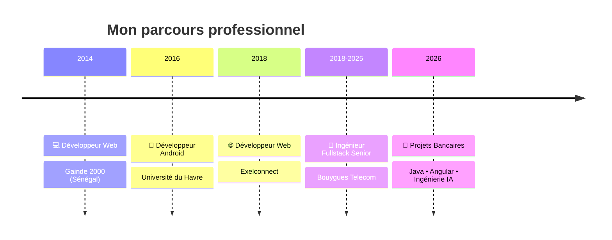

<p align="right">
  <a href="./README.md">
     <b>English</b>
  </a>
  &nbsp;|&nbsp;
  <a href="./README.fr.md">
     <b>Français</b>
  </a>
</p>

---

<h1 align="center">
👋 Bonjour, je suis Mouhamadou Moustapha LO
</h1>

<h3 align="center">
Ingénieur Fullstack Senior • Java • Angular • Cloud • DevOps • IA
</h3>

<p align="center">


</p>

---

<p align="center">


</p>

---

# 🚀 À propos de moi

Je suis **Ingénieur Fullstack Senior** avec plus de **8 années d'expérience** dans la conception et le développement d'applications d'entreprise.

Au cours de mon parcours, j'ai contribué à :

- ☁️ Des migrations vers le Cloud
- 🔄 La modernisation d'applications legacy
- ⚙️ L'automatisation DevOps
- 📡 Des systèmes d'information télécom
- 📊 Des plateformes de traitement de données
- 🏗️ Des architectures microservices
- 🤖 Le développement logiciel assisté par l'IA

J'aime concevoir des systèmes évolutifs, améliorer la qualité logicielle, automatiser les tâches répétitives et exploiter l'**IA générative** afin d'accélérer le développement logiciel.

---

# 💼 Ce sur quoi je travaille actuellement

- 🚀 Java 21 & Spring Boot 4
- ⚡ Angular 21+
- ☁️ AWS Cloud
- 🐳 Docker & Kubernetes
- 🔄 Automatisation CI/CD
- 🤖 Agents IA
- 🧠 Ingénierie des LLM
- 📡 Architecture orientée événements (Event-Driven)

---

# 🧠 Domaines d'expertise

```text
Développement Backend
█████████████████████████████ 100%

Développement Frontend
█████████████████████████░░░░ 90%

Cloud Computing
███████████████████████░░░░░░ 85%

DevOps
███████████████████████░░░░░░ 85%

Architecture Logicielle
████████████████████████░░░░░ 90%

Intelligence Artificielle
██████████████████████░░░░░░░ 80%
```

---

# 🛠 Stack technique

## Backend

<p>


</p>

Java • Spring Boot • Apache Spark • NodeJS • Symfony • Python

---

## Frontend

<p>


</p>

Angular • React • JavaScript • TypeScript • HTML5 • CSS3

---

## Cloud & DevOps

<p>


</p>

AWS • Docker • Kubernetes • GitLab CI/CD • Jenkins • Ansible • JFrog Artifactory • SonarQube • Prometheus • Grafana

---

## Bases de données

<p>


</p>

Oracle • SQL Server • PostgreSQL • MySQL

---

## Messagerie

<p>


</p>

Kafka • RabbitMQ

---

## Ingénierie IA

<p align="center">
  <a href="https://go-skill-icons.vercel.app/">
    
  </a>
</p>

GitHub Copilot • Claude • Claude Code • Codex • ChatGPT • Gemini

- Workflows LLM personnalisés
- Prompt Engineering
- Agents IA

---

# 🎯 Ce qui me caractérise

✅ Développement de logiciels d'entreprise

✅ Modernisation des systèmes legacy

✅ Migration vers le Cloud

✅ Architectures microservices

✅ Automatisation DevOps

✅ Clean Architecture

✅ Applications haute performance

✅ Développement augmenté par l'IA

---

# 💼 Expérience professionnelle

## 📅 Parcours professionnel



---

# 🚀 Expérience en entreprise

Depuis plus de **8 ans**, je conçois, développe et modernise des logiciels d'entreprise au sein de grandes organisations.

### Ingénieur Fullstack Senior (2018–2025)

Mon expertise couvre notamment :

- ☁️ Migration vers le Cloud
- 🏗️ Architecture logicielle
- ⚙️ Automatisation DevOps
- 📡 Systèmes d'information Télécom
- 📊 Traitement Big Data
- 🔄 Modernisation des applications legacy
- 🤖 Développement assisté par l'IA

---

# 🎯 Centres d'intérêt

- Architecture logicielle
- Développement Cloud Native
- Automatisation DevOps
- Ingénierie IA
- Systèmes d'entreprise évolutifs
