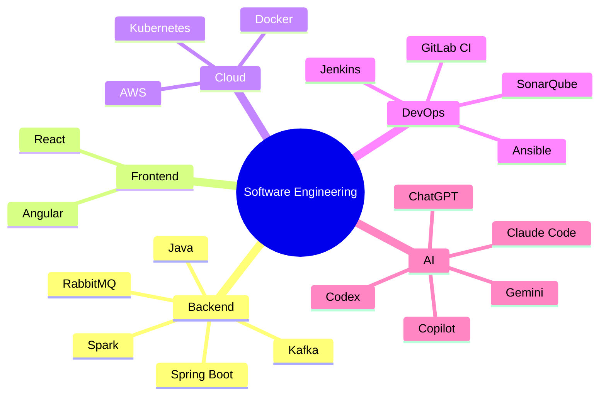
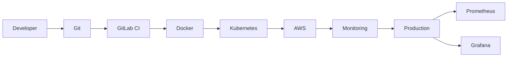
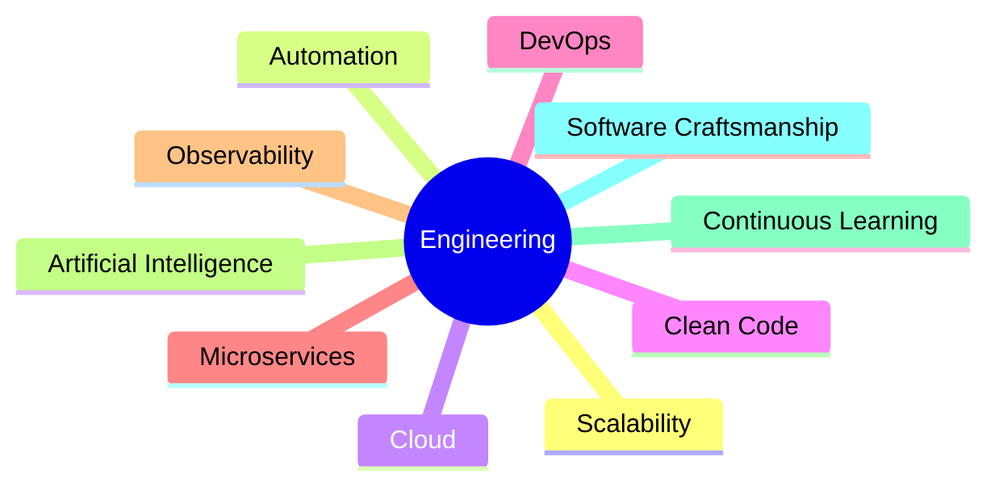

<p align="right">
  <a href="./README.md">
     <b>English</b>
  </a>
  &nbsp;|&nbsp;
  <a href="./README.fr.md">
     <b>Français</b>
  </a>
</p>

---

<h1 align="center">
👋 Hi, I'm Mouhamadou Moustapha LO
</h1>

<h3 align="center">
Senior Fullstack Engineer • Java • Angular • Cloud • DevOps • AI Engineering
</h3>

<p align="center">


</p>

---

<p align="center">


</p>

---

# 🚀 About Me

I'm a **Senior Fullstack Software Engineer** with **8+ years of experience** designing and developing enterprise-grade applications.

Throughout my career, I've contributed to:

- ☁ Cloud migrations
- 🔄 Legacy application modernization
- ⚙ DevOps automation
- 📡 Telecom information systems
- 📊 Data processing platforms
- 🏗 Microservices architectures
- 🤖 AI-assisted software engineering

I enjoy designing scalable systems, improving software quality, automating repetitive tasks and leveraging **Generative AI** to accelerate software delivery.

---

# 💼 What I'm Working On

- 🚀 Java 21 & Spring Boot 4
- ⚡ Angular 21+
- ☁ AWS Cloud
- 🐳 Docker & Kubernetes
- 🔄 CI/CD Automation
- 🤖 AI Agents
- 🧠 LLM Engineering
- 📡 Event-Driven Architecture

---

# 🧠 Core Expertise

```text
Backend Development
█████████████████████████████ 100%

Frontend Development
█████████████████████████░░░░ 90%

Cloud Computing
███████████████████████░░░░░░ 85%

DevOps
███████████████████████░░░░░░ 85%

Software Architecture
████████████████████████░░░░░ 90%

Artificial Intelligence
██████████████████████░░░░░░░ 80%
```

---

# 🛠 Tech Stack

## Backend

<p>


</p>

Java • Spring Boot • Apache Spark • NodeJS • Symfony • Python

---

## Frontend

<p>


</p>

Angular • React • JavaScript • TypeScript • HTML5 • CSS3

---

## Cloud & DevOps

<p>


</p>

AWS • Docker • Kubernetes • GitLab CI/CD • Jenkins • Ansible • JFrog Artifactory • SonarQube • Prometheus • Grafana

---

## Databases

<p>


</p>

Oracle • SQL Server • PostgreSQL • MySQL

---

## Messaging

<p>


</p>

Kafka • RabbitMQ

---

## AI Engineering

<p align="center">
  <a href="https://go-skill-icons.vercel.app/">
    
  </a>
</p>

GitHub Copilot • Claude • Claude Code • Codex • ChatGPT  • Gemini

Custom LLM Workflows

Prompt Engineering

AI Agents

---

# 🏗 Engineering Mindset



---

# ☁ Cloud Native Workflow


---

# 📈 Software Delivery Lifecycle

```mermaid
flowchart TD
    BusinessNeed["Business Need"] --> Architecture["Architecture"]
    Architecture --> Development["Development"]
    Development --> AIAssistedCoding["AI Assisted Coding"]
    AIAssistedCoding --> Testing["Testing"]
    Testing --> CICD["CI/CD"]
    CICD --> Deployment["Deployment"]
    Deployment --> Monitoring["Monitoring"]
    Monitoring --> ContinuousImprovement["Continuous Improvement"]
```---

# 🎯 What Defines Me

✅ Enterprise Software Development

✅ Legacy System Modernization

✅ Cloud Migration

✅ Microservices

✅ DevOps Automation

✅ Clean Architecture

✅ High Performance Applications

✅ AI-Augmented Development

---

# 💬 Favorite Quote

> **"Build software that scales. Automate everything. Let AI handle repetitive work so engineers can focus on solving real business problems."**

---


---

# 💼 Professional Experience

## 📅 Career Timeline

```mermaid
timeline

    title My Professional Journey

    2014 : 💻 Web Developer
         : Gainde 2000 (Senegal)

    2016 : 📱 Android Developer
         : University of Le Havre

    2018 : 🌐 Web Developer
         : Exelconnect

    2018-2025 : 🚀 Senior Fullstack Engineer
              : Bouygues Telecom

    2026 : 🏦 Banking Projects
         : Java • Angular • AI Engineering
```

---

# 🚀 Enterprise Experience

For more than **8 years**, I've been designing, developing and modernizing enterprise software in large organizations.

My expertise combines:

- ☁ Cloud Migration
- 🏗 Software Architecture
- ⚙ DevOps Automation
- 📡 Telecom Information Systems
- 📊 Big Data Processing
- 🔄 Legacy Modernization
- 🤖 AI-assisted Development

---

# 📡 Bouygues Telecom

## Senior Fullstack Java / Angular Engineer

**2018 — 2025**

> Industrialization, modernization and migration of six critical business applications used for roaming, billing, international routing and telecom data processing.

---

## 🏆 Key Achievements

### ☁ Cloud Migration

✔ Migrated legacy applications to AWS

✔ EC2

✔ RDS

✔ Lambda

✔ S3

---

### ⚙ DevOps Industrialization

Implemented complete DevOps workflows including:

- GitLab CI/CD
- Docker
- Kubernetes
- Ansible
- Artifactory
- SonarQube
- iDeploy

---

### 🏗 Legacy Modernization

Modernized historical applications by replacing:

Legacy PHP

⬇

Angular 18

+

Spring Boot

---

### 📊 Big Data

Migrated Talend jobs into

- Spring Boot microservices
- Apache Spark jobs

---

### 📡 Telecom

Worked on critical systems handling

- Roaming
- International Routing
- Billing
- Number Portability
- Data Warehouses

---

### 🚀 Performance

Designed high-volume batch processing.

Optimized Oracle procedures.

Prepared infrastructure for major traffic peaks.

---

### 📈 Monitoring

Implemented production monitoring using

- Prometheus

- Grafana

---

# 🏗 Technical Ecosystem

```mermaid
graph TD

BusinessApplications

-->

GitLab

GitLab

-->

CI/CD

CI/CD

-->

Docker

Docker

-->

Kubernetes

Kubernetes

-->

AWS

AWS

-->

Spring Boot

Spring Boot

-->

RabbitMQ

RabbitMQ

-->

Oracle

Spring Boot

-->

Spark

Spark

-->

Monitoring

Monitoring

-->

Grafana
```

---

# 🧠 AI-assisted Software Engineering

During recent projects I integrated AI into everyday software development.

## Daily Usage

✅ GitHub Copilot

✅ Claude Code

✅ Codex

✅ ChatGPT

✅ Claude

✅ Gemini

---

## AI-assisted Activities

- Generate production-ready code

- Accelerate refactoring

- Produce technical documentation

- Improve unit tests

- Debug complex systems

- Prototype applications

- Generate scripts

- Explain legacy code

- Review pull requests

- Improve software quality

---

# 🚀 Typical Engineering Workflow

```mermaid
flowchart LR

Requirements

-->

Architecture

-->

Development

-->

GitHub Copilot

-->

Code Review

-->

Testing

-->

CI/CD

-->

Deployment

-->

Monitoring
```

---

# 🌍 Industries

| Industry | Experience |
|-----------|------------|
| 📡 Telecommunications | ⭐⭐⭐⭐⭐ |
| 🚚 Logistics | ⭐⭐⭐⭐ |
| ☁ Cloud Migration | ⭐⭐⭐⭐⭐ |
| 📊 Data Engineering | ⭐⭐⭐⭐ |
| 🤖 AI Engineering | ⭐⭐⭐⭐ |
| 🏦 Banking | ⭐⭐⭐⭐ |

---

# 🏅 Highlights

🏆 8+ years of experience

☁ AWS Cloud Migration

🚀 Modernized 6 enterprise applications

🏗 Designed Microservices Architectures

⚙ Built CI/CD Pipelines

📊 Apache Spark Data Processing

📡 RabbitMQ Messaging

🧠 AI-Augmented Development

🔄 Legacy Application Modernization

👥 Agile Scrum

---

# 🎯 Engineering Philosophy



---

# 📚 Continuous Learning

I continuously invest in improving my engineering skills.

## Recent Focus

- 🤖 AI Agents

- Claude Code

- Codex

- Agentic AI

- Prompt Engineering

- Java 21

- Spring Boot 4

- Angular 21+

- Cloud Native Development

- Kubernetes

- LLM-powered Development

---

# 📈 Impact

```text
Cloud Migration        ████████████████████████

Microservices          ████████████████████████

Java Development       ██████████████████████████

Angular                ███████████████████████

DevOps                 ██████████████████████

Architecture           █████████████████████

Artificial Intelligence███████████████████
```
